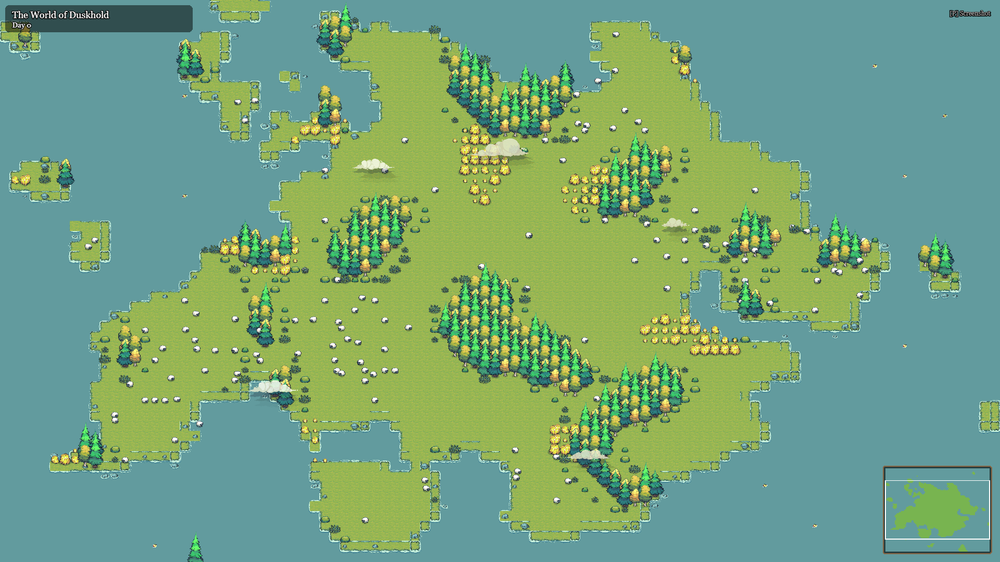
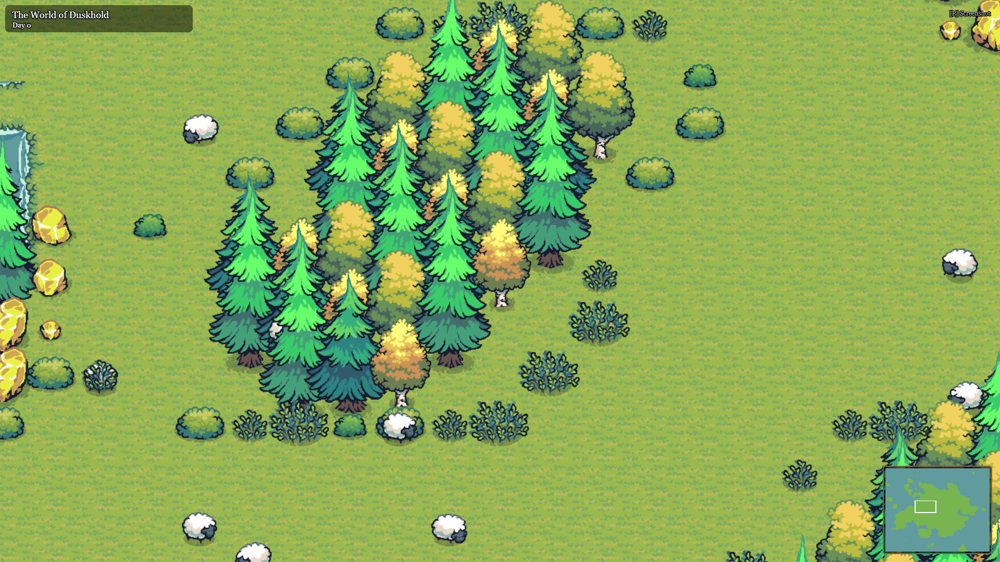
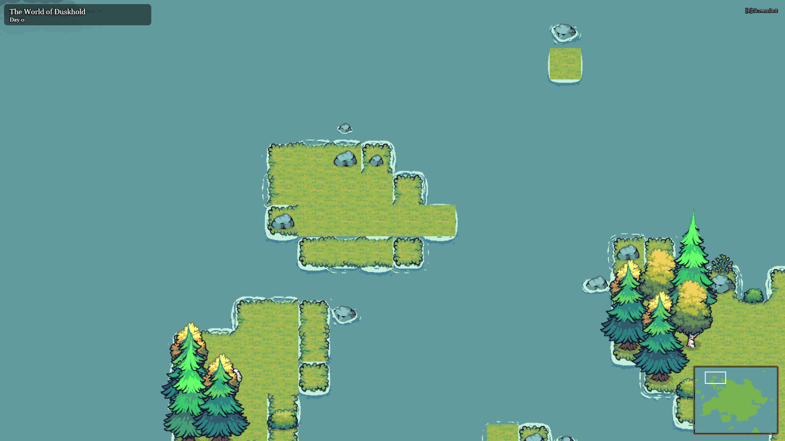
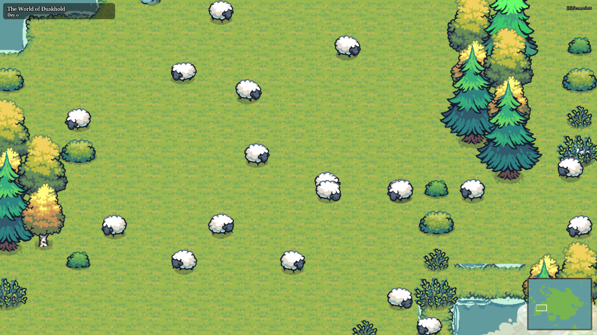
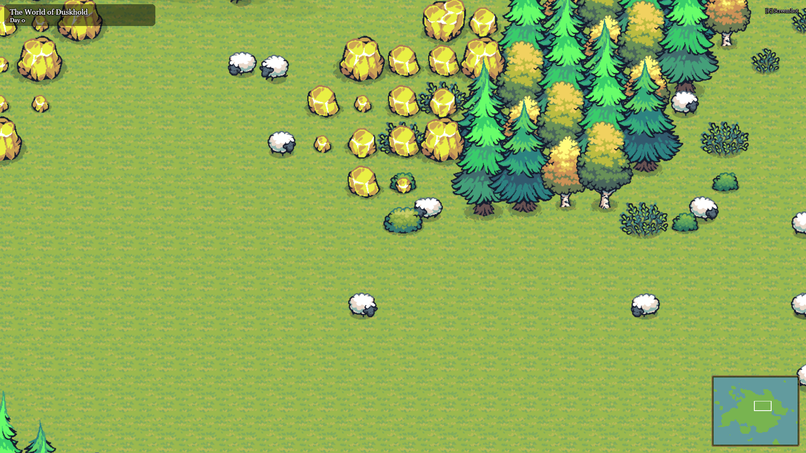
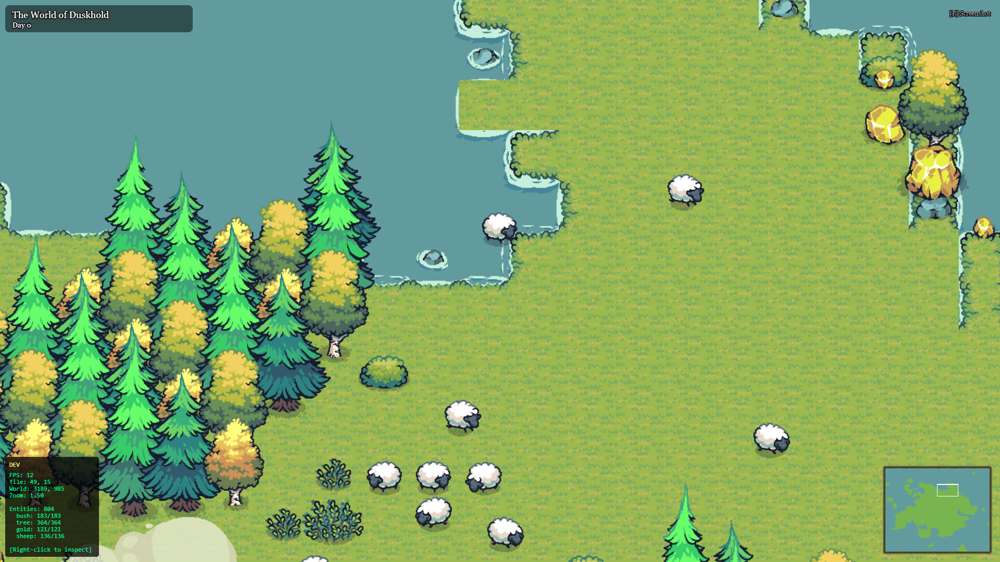

# GobSim

A living, breathing goblin village simulator where tiny green creatures build a civilization driven by genetic algorithms and emergent narrative.

Every world is procedurally generated — unique terrain, coastlines, forests, and wildlife. Sheep wander the meadows, bushes sway in the wind, and gold glimmers in the hills. This is the foundation for a full goblin society simulation coming soon.



---

## The World

Each world is a procedurally generated island surrounded by ocean. Terrain is built from layered noise functions, creating natural-looking landmasses with beaches, meadows, forests, and rocky outcrops.



Coastlines feature animated water foam, scattered rocks, and the occasional rubber duck.



---

## Living Resources

The world isn't static — it's a living ecosystem.



- **Sheep** roam the grasslands with full AI — idling, wandering between tiles, and grazing. They avoid water, reproduce when populations drop, and will flee from threats (once goblins arrive).

- **Berry Bushes** can be harvested and will regrow over time through a depleted-to-regrowing-to-full cycle.

- **Trees** can be chopped for wood. They leave stumps, sprout saplings, and eventually grow back to full size.

- **Gold Stones** are a non-renewable resource scattered across the terrain — mine them before they're gone.

- **Dropped Items** (meat, wood, gold) sit on the ground waiting to be picked up, with a gradual despawn timer.



---

## Dev Overlay

Press **\`** or **F3** to toggle the developer overlay — live FPS, cursor tile coordinates, zoom level, and resource counts at a glance. Right-click any entity to inspect it: the camera locks on and follows it with a selection bracket, showing its state machine, timers, and internal data in real time.



---

## Features

- Procedural world generation with unique seeds
- Animated terrain — swaying trees, flowing water foam, drifting clouds
- Full resource management system with state machines
- Sheep AI — idle, wander, graze, flee (4-state behavior)
- Harvestable bushes, choppable trees, mineable gold
- Resource regrowth and sheep reproduction
- Smooth camera with drag-pan, scroll-zoom, and bounds clamping
- Cinematic intro sequence with world name reveal
- HUD with world name and day counter
- Live minimap with viewport indicator
- Screenshot capture (press **P**)
- Dev overlay with entity inspection and camera follow
- Particle effects (dust, explosions)
- Expandable type registry — adding new resource types requires just a config file

---

## Tech Stack

- **PixiJS v8** — WebGL 2D rendering
- **Vite** — dev server and bundler
- **Tiny Swords Free Pack** — pixel art assets by Pixel Frog

---

## Getting Started

```bash
npm install
npm run dev
```

Open `http://localhost:5173` in your browser.

Add `?seed=12345` to the URL to load a specific world.

---

## Controls

| Key | Action |
|-----|--------|
| Click + Drag | Pan camera |
| Scroll | Zoom in/out |
| P | Take screenshot |
| \` or F3 | Toggle dev overlay |
| Right-click (dev mode) | Inspect entity |
| Space | Skip intro |

---

## What's Next

Goblins are coming. They'll harvest resources, build shelters, form relationships, and evolve across generations through genetic algorithms. Each goblin will have a unique DNA strand affecting their traits, a memory system that shapes decisions, and a drive chemistry model creating emergent personalities.

Stay tuned.

---

*Built with care, chaos, and a little bit of goblin energy.*
